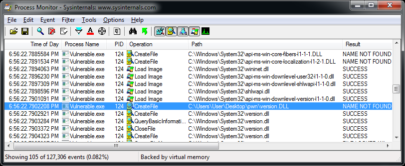
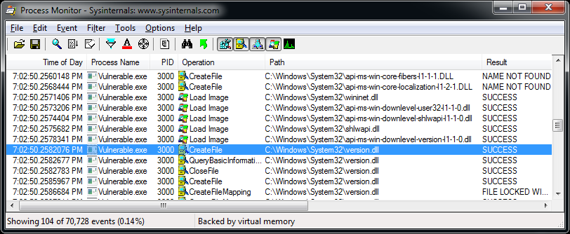

*Why your C++ (or not) app is probably vulnerable right now*

![[assets/safe-code-pitfalls-dll-side-loading-winapi-and-cpp/flex-tape-version-dll.png|DLL side-loading article cover|640]]

## Brief reminder

The technique of executing your own "evil" code by loading specially prepared DLLs is quite well researched: from basic [search order](https://docs.microsoft.com/en-us/windows/win32/dlls/dynamic-link-library-search-order) hijacking and loading the library from the application folder, to more [advanced techniques](https://silentbreaksecurity.com/adaptive-dll-hijacking/).

The nature of this vulnerability stems, in part, from the historical approach in Windows architecture. Let's remember how dangerous DLL hijacking is. It can, at least:

1. Cause [EoP](https://en.wikipedia.org/wiki/Privilege_escalation). If we manage to force the executable file registered as a high privilege service to load our DLL, then we [will get the same privileges](https://pentestlab.blog/2017/03/27/dll-hijacking/).
2. Be a technique of hacking and persistence in the system. Many [APT](https://en.wikipedia.org/wiki/Advanced_persistent_threat) attacks start with a [bundle](https://www.zdnet.com/article/trojanized-teamviewer-used-in-government-political-attacks-across-europe/) of a malicious DLL and an EXE file signed with a valid signature.

The presence of the digital signature often removes a lot of suspicion from behavior-based [EDR](https://en.wikipedia.org/wiki/Endpoint_detection_and_response) solutions, and even more so if there is a "trusted" list in it, and the file/signature matches. Of course, serious EDRs should always monitor not only which process is doing malicious actions, but also which thread is being executed and which image it belongs to.

So DLL hijacking protection is not only protection at the EDR level, but also protection of your EXE at code level.

## Theory

What do we know about basic DLL hijacking?

1. The system has a list of "friendly" DLLs. It's called KnownDLLs. Such libraries are always loaded from the system catalog, and you can be sure that an attacker cannot put DLLs into the system catalog. If they can, you are already in trouble.

If you want to get an actual list of KnownDLLs, do not read it from the registry, because this fingerprint may not match the real list used by the system. Use the [Object Manager](https://lucasg.github.io/2017/06/07/listing-known-dlls/).

2. Libraries loaded through the [WinSxS](https://en.wikipedia.org/wiki/Side-by-side_assembly) [redirection mechanism](https://docs.microsoft.com/en-us/windows/win32/apiindex/windows-apisets) are first searched for in the system directories.

If you want to get an actual list of WinSxS DLLs, [read](https://blog.quarkslab.com/runtime-dll-name-resolution-apisetschema-part-i.html) the `ApisetMap` field from the PEB or [parse](https://blog.quarkslab.com/runtime-dll-name-resolution-apisetschema-part-ii.html) the `.apiset` section of `apisetschema.dll`.

3. Windows has system calls that minimize the risk of DLL side-loading.

The main functions added for protection are [`SetDefaultDllDirectories()`](https://docs.microsoft.com/en-us/windows/win32/api/libloaderapi/nf-libloaderapi-setdefaultdlldirectories) and [`SetDllDirectory()`](https://docs.microsoft.com/en-us/windows/win32/api/winbase/nf-winbase-setdlldirectoryw). Later, the special linker [option](https://docs.microsoft.com/en-us/cpp/build/reference/dependentloadflag) `/DEPENDENTLOADFLAG` was also added.

4. To prevent the EXE loader from loading DLLs before the required directories are set at runtime, you need to adjust linker settings so DLL loading is [delayed](https://docs.microsoft.com/en-us/cpp/build/reference/delayload-delay-load-import).

## Practice

So, to prevent side-loading, we should enable delayed loading of DLLs and call special WinAPI functions before doing anything else. Then further loading of any DLL without specifying the full path should not compromise the running process.

Let's see how it looks in code:

```cpp
typedef BOOL(WINAPI *pfnSetDefaultDllDirectories)(DWORD DirectoryFlags);
typedef BOOL(WINAPI *pfnSetDllDirectoryW)(LPCWSTR lpPathName);

#define LOAD_LIBRARY_SEARCH_SYSTEM32 0x00000800

int WINAPI wWinMain(
  HINSTANCE hInstance,
  HINSTANCE /*hPrevInstance*/,
  LPTSTR /*lpstrCmdLine*/,
  int /*nCmdShow*/
) {
  HMODULE hKernel32 = GetModuleHandle(L"kernel32.dll");

  auto pSetDefaultDllDirectories =
    (pfnSetDefaultDllDirectories)GetProcAddress(hKernel32, "SetDefaultDllDirectories");
  if (pSetDefaultDllDirectories != nullptr) {
    pSetDefaultDllDirectories(LOAD_LIBRARY_SEARCH_SYSTEM32);
  }

  auto pSetDllDirectory =
    (pfnSetDllDirectoryW)GetProcAddress(hKernel32, "SetDllDirectoryW");
  if (pSetDllDirectory != nullptr) {
    pSetDllDirectory(L"");
  }
}
```

Then compile, set breakpoints on `LoadLibrary*()` and `wWinMain()`, and launch the executable:

```text
kernel32.dll!LoadLibraryExWStub#()
Vulnerable.exe!try_load_library_from_system_directory()
Vulnerable.exe!try_get_module(const `anonymous-namespace'::module_id id=api_ms_win_core_synch_l1_2_0)
Vulnerable.exe!try_get_first_available_module()
Vulnerable.exe!try_get_proc_address_from_first_available_module()
Vulnerable.exe!try_get_function()
Vulnerable.exe!try_get_InitializeCriticalSectionEx()
Vulnerable.exe!__vcrt_InitializeCriticalSectionEx()
Vulnerable.exe!__vcrt_initialize_locks()
Vulnerable.exe!__vcrt_initialize()
Vulnerable.exe!__scrt_initialize_crt()
Vulnerable.exe!__scrt_common_main_seh()
Vulnerable.exe!__scrt_common_main()
Vulnerable.exe!wWinMainCRTStartup()
kernel32.dll!BaseThreadInitThunk#()
ntdll.dll!RtlUserThreadStart#()
```

We hit C runtime initialization. Continue executing and take a look at the `module_id` argument. It looks like `api-ms-win-core-synch-l1-2-0`, `api-ms-win-core-fibers-l1-1-1`, and `api-ms-win-core-localization-l1-2-1`. So far so good, WinSxS libraries are loaded.

Continue:

```text
KernelBase.dll!LoadLibraryExW()
KernelBase.dll!LoadLibraryExA#()
Vulnerable.exe!__delayLoadHelper2(const ImgDelayDescr * pidd=0x00007ff658b6a080, __int64(*)() * ppfnIATEntry=0x00007ff658b6c690) C++
Vulnerable.exe!__tailMerge_USER32_dll#()
Vulnerable.exe!`dynamic initializer for 'WM_RESET_WINDOW_POSITION_DB''()
Vulnerable.exe!_initterm(void(*)() * first=0x00007ff657333000, void(*)() * last=0x00007ff657341818)
Vulnerable.exe!__scrt_common_main_seh()
Vulnerable.exe!__scrt_common_main()
Vulnerable.exe!wWinMainCRTStartup()
kernel32.dll!BaseThreadInitThunk#()
ntdll.dll!RtlUserThreadStart#()
```

We are interested in the line `Vulnerable.exe!_initterm(void(*)() *)`. [`initterm()`](https://docs.microsoft.com/ru-ru/cpp/c-runtime-library/reference/initterm-initterm-e) is a function called during the initialization of C++ global variables. These variables are initialized before `main()`.

The global variable in the project that provokes the loading of `user32.dll`:

```cpp
static const UINT WM_POSITION_DB = ::RegisterWindowMessage(L"GUID");
```

Moreover, global variables can be in the code of other libraries you use, [for example](https://www.boost.org/doc/libs/1_54_0/boost/asio/detail/winsock_init.hpp):

```cpp
// Static variable to ensure that winsock is initialized before main, and
// therefore before any other threads can get started.
static const winsock_init<>& winsock_init_instance = winsock_init<>(false);
```

The above code provokes the loading of `ws2_32.dll`. In my case it is listed in KnownDLLs:

```text
KernelBase.dll!LoadLibraryExW()
KernelBase.dll!LoadLibraryExA#()
Vulnerable.exe!__delayLoadHelper2()
Vulnerable.exe!__tailMerge_WS2_32_dll#()
Vulnerable.exe!boost::asio::detail::winsock_init_base::startup()
Vulnerable.exe!boost::asio::detail::winsock_init<2,0>::winsock_init<2,0>()
Vulnerable.exe!boost::asio::detail::`dynamic initializer for 'winsock_init_instance''()
Vulnerable.exe!_initterm()
Vulnerable.exe!__scrt_common_main_seh()
Vulnerable.exe!__scrt_common_main()
Vulnerable.exe!wWinMainCRTStartup()
kernel32.dll!BaseThreadInitThunk#()
ntdll.dll!RtlUserThreadStart#()
```

To solve this problem we can:

1. Set DLL search directories before initialization of global variables.
2. Set directories during initialization of global variables, but strictly before any "dangerous" variables.

Option 1 is more explicit. Looking at the previous call stack, you can see that `wWinMainCRTStartup()` is being called, which is the entry point. Fortunately, we have the ability to [redefine it](https://docs.microsoft.com/ru-ru/cpp/build/reference/entry-entry-point-symbol):

```cpp
#pragma comment(linker, "/ENTRY:CustomMainCrtStartup")

int APIENTRY CustomMainCrtStartup()
{
  // Set directories here.
  return wWinMainCRTStartup();
}
```

Option 2 is more technically interesting: in theory, we cannot control the order of static initialization. In practice, the MSVC linker operates in terms of [code sections](https://developercommunity.visualstudio.com/t/access-violation-with-mtd-and-init-seg-pragma/335311#T-N368906):

> [!info] MSVC initializer order
> The sections between `.CRT$XCA` and `.CRT$XCZ` are filled with dynamic initializers for the program.
>
> There are three named initialization segments where dynamic initializers are placed:
> - compiler: registers to `.CRT$XCC`
> - lib: registers to `.CRT$XCL`
> - user, by default: registers to `.CRT$XCU`

We can declare a custom class or struct, which sets directories in its constructor, and define a global variable in a custom section in a separate `.cpp` file:

```cpp
#pragma optimize("", off)
#pragma init_seg(".CRT$XCB")

struct _dll_load_directory_t {
  _dll_load_directory_t() {
    // Set directories here.
  }
};

namespace {
  _dll_load_directory_t _dll_load_directory;
}
```

This approach is convenient for its portability: you just need to add one `.cpp` file to the project and don't need to change any other code or take into account that the entrypoint may already be redefined for other purposes.

Apply one of the fixes, run, and watch the [Procmon](https://docs.microsoft.com/en-us/sysinternals/downloads/procmon) log.



Windows 7 x64 with the latest updates.

As we can see, `version.dll` is loaded from the `.exe` path. We can google a huge number of related vulnerabilities, including various CVEs. Some [solve](https://github.com/Squirrel/Squirrel.Windows/blob/eef37460aef77b2f9de8cd2237c1e55b344a6554/src/Setup/winmain.cpp#L16) this problem by preloading "problematic" DLLs:

```cpp
// Some libraries are still loaded from the current directories.
// If we pre-load them with an absolute path then we are good.
void PreloadLibs()
{
  wchar_t sys32Folder[MAX_PATH];
  GetSystemDirectory(sys32Folder, MAX_PATH);

  std::wstring version = std::wstring(sys32Folder) + L"\\version.dll";
  std::wstring logoncli = std::wstring(sys32Folder) + L"\\logoncli.dll";
  std::wstring sspicli = std::wstring(sys32Folder) + L"\\sspicli.dll";

  LoadLibrary(version.c_str());
  LoadLibrary(logoncli.c_str());
  LoadLibrary(sspicli.c_str());
}
```

After some time, we have a minimal example that provokes `version.dll` side-loading:

```cpp
#define WIN32_LEAN_AND_MEAN
#include <windows.h>
#include "wininet.h"

#pragma comment(lib, "wininet.lib")

int main() {
  DWORD dummy;
  InternetCombineUrlA(nullptr, nullptr, nullptr, &dummy, 0);
}
```

Something went wrong, so let's return to debugging. After playing with breakpoints in `ntdll.dll`, we find something like this:

```text
ntdll.dll!LdrpSearchPath()
ntdll.dll!LdrpFindOrMapDll()
ntdll.dll!LdrpLoadDll()
ntdll.dll!LdrpSnapThunk()
ntdll.dll!LdrpSnapIAT()
ntdll.dll!LdrpHandleOneOldFormatImportDescriptor()
ntdll.dll!LdrpProcessStaticImports()
ntdll.dll!LdrpLoadDll()
ntdll.dll!LdrLoadDll()
KernelBase.dll!LoadLibraryExW()
KernelBase.dll!LoadLibraryExA()
ConsoleApplication.exe!__delayLoadHelper2()
ConsoleApplication.exe!__tailMerge_wininet_dll()
ConsoleApplication.exe!main()
ConsoleApplication.exe!invoke_main()
ConsoleApplication.exe!__scrt_common_main_seh()
ConsoleApplication.exe!__scrt_common_main()
ConsoleApplication.exe!mainCRTStartup()
kernel32.dll!BaseThreadInitThunk()
ntdll.dll!RtlUserThreadStart()
```

We need to understand why `LdrpSearchPath()` started the search in our directory. We can reverse `ntdll.dll`, but I took the easy way and inspected the ReactOS sources.

## Research

Note the line:

```cpp
if (!ActualSearchPath) *SearchPath = LdrpDefaultPath.Buffer;
```

`SearchPath` is [used](https://doxygen.reactos.org/dd/d83/ntdllp_8h.html#a23c8882377ce8f48fdf70decd1294a7f) at least in `LdrpCheckForLoadedDll()`, `LdrpMapDll()`, `LdrpResolveDllName()`, `LdrpSearchPath()`, and `LdrpInitializeProcess()`. It hints that the problem may occur in several places.

Take a look at `LdrpInitializeProcess()`:

```cpp
/* If we have process parameters, get the default path and current path */
if (ProcessParameters)
{
  /* Check if we have a Dll Path */
  if (ProcessParameters->DllPath.Length)
  {
    /* Get the path */
    LdrpDefaultPath = *(PUNICODE_STRING)&ProcessParameters->DllPath;
  }
}
```

The string for `LdrpDefaultPath` is assigned from `ProcessParameters->DllPath`, and this is nothing more than a [field from the PEB](http://undocumented.ntinternals.net/index.html?page=UserMode%2FStructures%2FRTL_USER_PROCESS_PARAMETERS.html).

Let's see the initialization:

```cpp
/* Get the DLL Path */
DllPathString = BaseComputeProcessDllPath(FullPath, lpEnvironment);
if (!DllPathString)
...

/* Initialize Strings */
RtlInitUnicodeString(&DllPath, DllPathString);
RtlInitUnicodeString(&ImageName, FullPath);
```

In [`BaseComputeProcessDllPath()`](https://doxygen.reactos.org/db/dcb/dll_2win32_2kernel32_2client_2path_8c.html#a57d2334501436f631bd158a5ddae2531) code we see that a list of directories is generated that matches the [list from MSDN](https://docs.microsoft.com/en-us/windows/win32/dlls/dynamic-link-library-search-order). The first on this list is always the directory of the application, which is a problem.

We note that all these policies appeared at some point, and even in Windows 7 they appeared only with [KB2533623](https://support.microsoft.com/en-us/topic/microsoft-security-advisory-insecure-library-loading-could-allow-remote-code-execution-486ea436-2d47-27e5-6cb9-26ab7230c704). As we realized, the `DllPath` field participates in the dependency loading mechanism. And the evidence shows that KB2533623 does not fix all the problems: there still exist several loading mechanisms, which is hinted at by the `LdrpHandleOneOldFormatImportDescriptor()` function in the call stack.

On my Windows 10 installation, for example, the `DllPath` field is not even initialized.

To summarize: after initialization of the PEB, the string from `DllPath` is assigned to some variable, which is then also assigned, and then again and again, but in the end they all refer to the same string in memory. So the only way to fix it is to change the string in memory. We can get the address from the PEB itself. The code tells us that the path to the application is always first in the list, and the directories are separated with `;`.

```cpp
UNICODE_STRING DllPath = NtCurrentPeb()->ProcessParameters->DllPath;
UNICODE_STRING ImagePathDir = NtCurrentPeb()->ProcessParameters->ImagePathName;

if (DllPath.Buffer == nullptr) {
  return;
}

// Get first dir from PEB's DllPath.
{
  wchar_t *delim = wcschr(DllPath.Buffer, L';');
  if (delim != nullptr) {
    DllPath.Length = (USHORT)WCHARS_TO_BYTES(delim - DllPath.Buffer);
  }
}

// Get dir of current image.
{
  wchar_t *slash = wcsrchr(ImagePathDir.Buffer, L'\\');
  if (slash == nullptr) {
    slash = wcsrchr(ImagePathDir.Buffer, L'/');
    if (slash == nullptr) {
      return;
    }
  }

  ImagePathDir.Length =
    (USHORT)WCHARS_TO_BYTES(slash - ImagePathDir.Buffer) + sizeof(wchar_t);

  // Don't remove last backslash in case of root path, e.g. C:\
  if (!(ImagePathDir.Length == 6 &&
        iswalpha(ImagePathDir.Buffer[0]) &&
        ImagePathDir.Buffer[1] == L':' &&
        (ImagePathDir.Buffer[2] == L'\\' || ImagePathDir.Buffer[2] == L'/'))) {
    ImagePathDir.Length -= sizeof(wchar_t);
  }
}

if (RtlCompareUnicodeString(&DllPath, &ImagePathDir, TRUE) == 0) {
  wmemset(DllPath.Buffer, L';', BYTES_TO_WCHARS(DllPath.Length));
}
```

Original `DllPath`:

```text
C:\Users\User\Desktop\pwn;;C:\Windows\system32;C:\Windows\system;C:\Windows;.;C:\Windows\system32;C:\Windows;C:\Windows\System32\Wbem;C:\Windows\System32\WindowsPowerShell\v1.0\;C:\Windows\System32\WindowsPowerShell\v1.0\
```

Modified `DllPath`:

```text
;;;;;;;;;;;;;;;;;;;;;;;;;;;C:\Windows\system32;C:\Windows\system;C:\Windows;.;C:\Windows\system32;C:\Windows;C:\Windows\System32\Wbem;C:\Windows\System32\WindowsPowerShell\v1.0\;C:\Windows\System32\WindowsPowerShell\v1.0\
```

I just removed the directory from the list, but you may need to leave the ability to load your DLLs from the application directory. To do this, you can simply re-sort this list. You can also remove the application directory and the current directory from the list to avoid being affected by [phantom DLL hijacking](http://www.hexacorn.com/blog/2013/12/08/beyond-good-ol-run-key-part-5/). You can also remove the `;.;` directory.

A similar PEB hack can be used for [usermode process masquerading](https://www.ired.team/offensive-security/defense-evasion/masquerading-processes-in-userland-through-_peb).

Let's see if our fix works.



It does!

> [!success] Takeaways
> 1. DLL side-loading is not a bug which can be fixed once and for all, but a source of vulnerabilities. Companies should have a pentest team to preventively find vulnerabilities, so that outside security researchers or black hats do not do it first.
> 2. The EXE loader in Windows 10+ behaves differently from Windows 7, and it remains to be seen how much more secure it is.
> 3. In general, it's quite difficult for EDRs to preventively detect DLL side-loading when it is used for malicious purposes. There is a high risk of blocking all legitimate activity. One effective way is using a model with a "trusted" list, which contains all manually approved EXE/DLL/path combinations, and restricts all others.
> 4. Even after you fix your code, there is still a chance that APT malware or hackers can deliver an evil bundle with a previous vulnerable version of your binary.

---

Originally published on [Medium](https://medium.com/@1ndahous3/safe-code-pitfalls-dll-side-loading-winapi-and-c-73baaf48bdf5).
